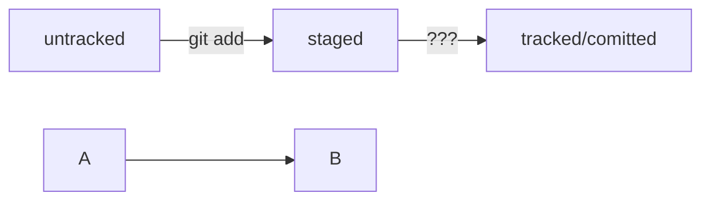

# Шпаргалка для работы с Git
## Здесь ты найдешь подсказки для успешной работы

### Создание файлов и директорий

Создать файл

```
touch имя_файла
```

Создать директорию

```
mkdir имя_директории
```

Создать структуру папок

```
mkdir -p
```

Поменять директорию

```
cd
```

Показать содержимое папки

```
ls

ls -a
```

Показать путь к текущей папке

```
pwd
```

Прочитать файл

```
cat
``` 

Копирование файлов

```
cp что_копируем куда_копируем
```

Перемещение файлов

```
mv что_перемещать куда_перемещать
```

Удаление файла

```
rm 
```

Удаление папки

```
rmdir 

rm -r удаление папки со всем ее содержимым
```

### Репозиторий Git 

Создать репозиторий 

```
git init 
```


разгитить папку 

```
rm -rf .git
```


проверить текущее состояние репозитория 

```
git status
```


#### Коммит - сохранение, фиксация состояния файла. "Сделать коммит" - значит сохранить текущую версию файла

Запомнить файлы, добавить их для отслеживания

```
git add 

git add . //добавить текущую папку со всеми файлами
```

Сделать коммит, сохранить версию. Будет сообщение с пояснением, в чем именно состояли изменения

```
git commit -m "текст пояснения"
```

Просмотреть историю коммитов

```
git log

git log --oneline // в терминале появятся только первые несколько символов хэша каждого элемента и их комментарии
```

Создать ссылку на файл

```
ln имя_существующего_файла имя_новой_ссылки
```

Создать символьную ссылку

```
ln -s абсолютный_адрес_файла адрес_создаваемой_ссылки
```


#### SHH - сетевой протокол(правила обмена данными между компьютерами).
Он использует пару ключей для обеспечения безопасности: публичный и приватный.


**Приватный** ключ хранится только на вашей компьютере и не должен передаваться кому-либо еще. Он используется для шифрования данных.

**Публичный** ключ доступен всем и используется для расшифровки данных, которые были зашифрованы приватным.

SHH-ключ - виртуальный идентификатор в github. Он позволяет получить доступ к github-репозиторию. Также используется для доступа к другим удаленным серверам.

Вывести список созданных ключей

```
ls -la .ssh/
```

Генерация SHH-пары

```
ssh-keygen -t ed25519 -C "эл-я почта, к которой привязан аккаунт github"
```


#### Статусы файлов в Git




